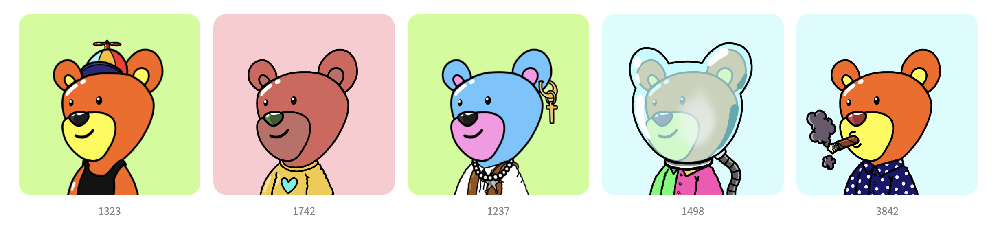
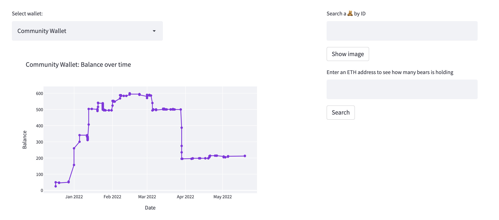

# NFT Dashboard: inBetweeners 🧸
##### Date: May 2022
#### Created by: Maria Soriano 👋🏼

👉🏼 [Check it out here](https://inbetweeners.herokuapp.com) 👈🏼

## About
I found myself immersed in the NFT world some time ago. 3 inBetweeners bears were my first NFTs.
After that I've been very active in the community. At some point I realized that holders where not very familiar to the NFT world. It was their first NFT too and some people didn't heard about NFTs before. They were struggling to understand how the devs and founders were moving the funds. The struggle got even harder when they decided to divide the funds into two different wallets. *Community Wallet* and *Operations Wallet*. At that point I thought it might be interesting to find a way to display the balance for those wallets in a more appealing and visual way. So that people who doesn't know much about it could easily understand and know about the current balance in both wallets, and also the dates when the movements were happening. That would facilitate transparency at the end...

The following dashboard allows you to chose between the **Community Wallet** and the **Operations Wallet** and displays the balance over time.
Also, it contains a couple more features.
- It can display the NFT image after entering the ID.
- It can display the token balance by a given address.
- It displays current **floor price**, **total volume** and **total number of owners**.

## Technologies used
* Python
* OpenSea API
* Streamlit
* Heroku (for deploying the App)

## What's next?
I am learning how to use **AWS**. The idea is the following:
- Automate an API call every hour that gets the current **floor price**
- Create a **database** where to store the data
- Plot **floor price**. 

Example of visualization